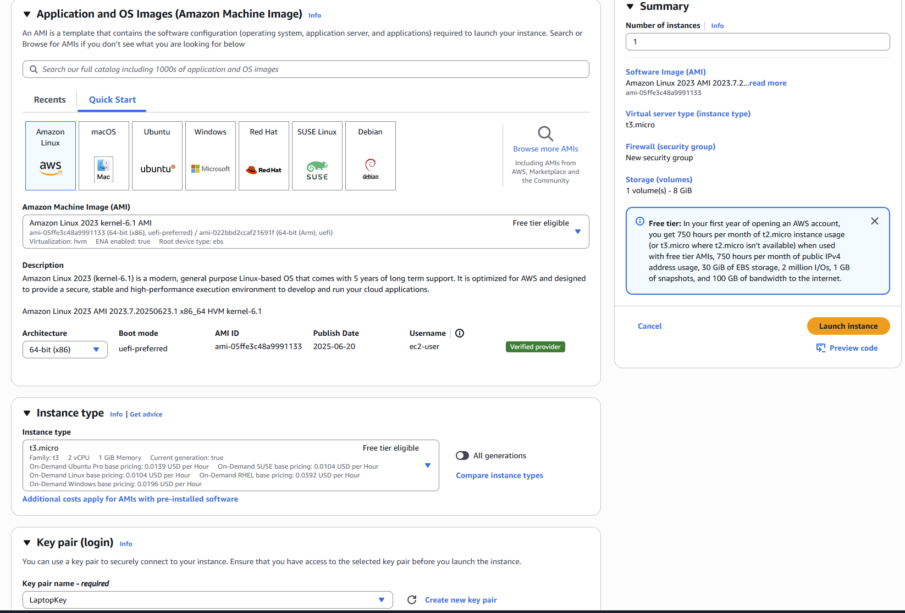
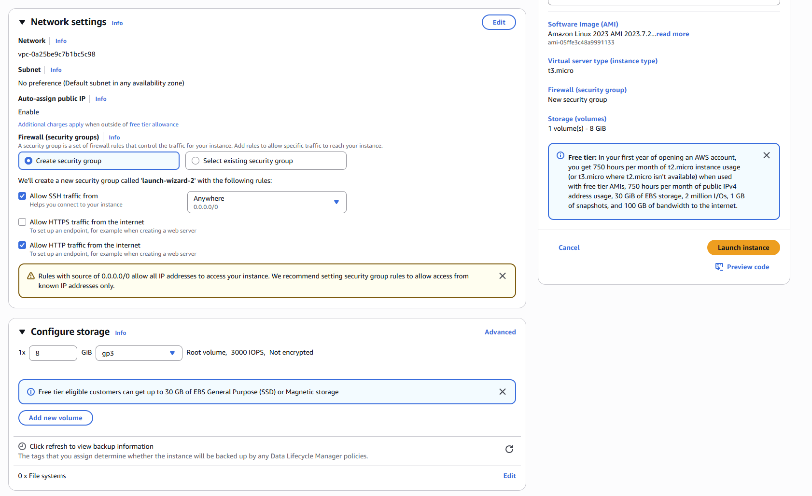
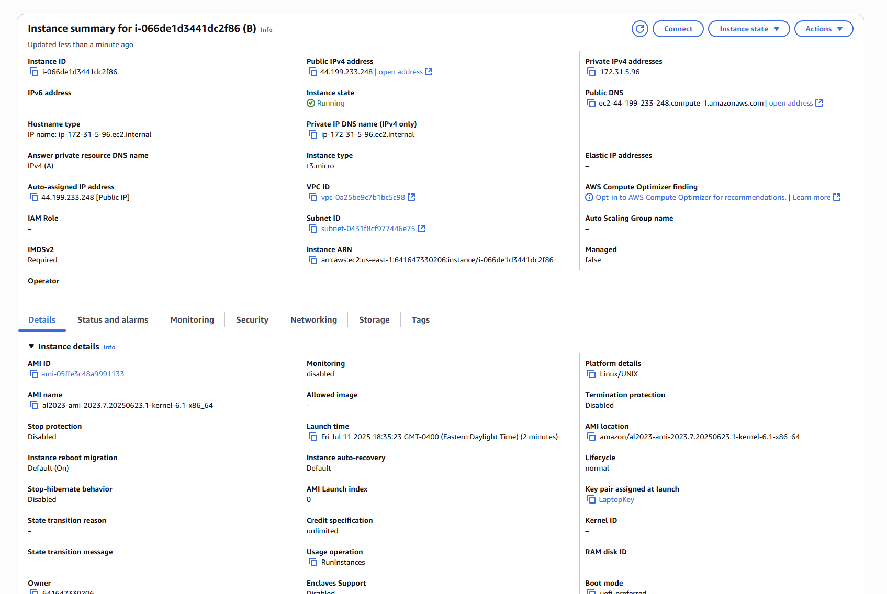
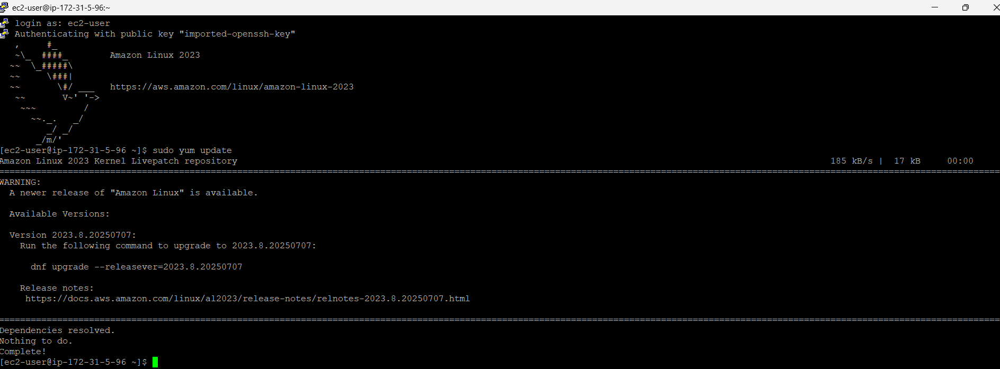
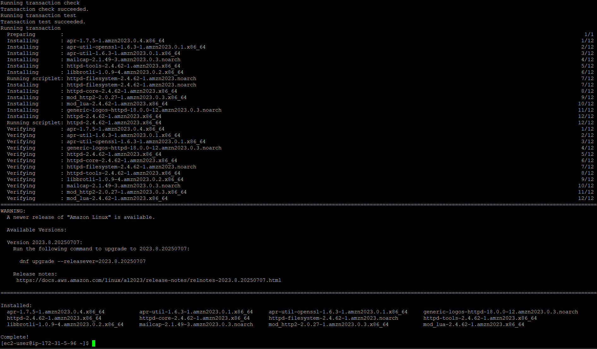
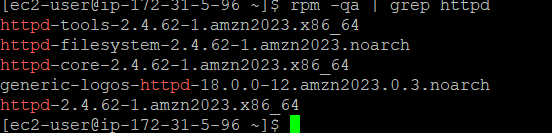
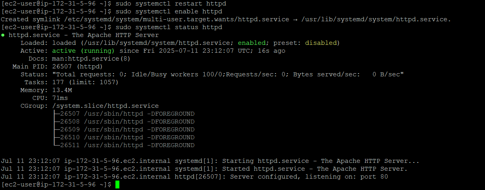
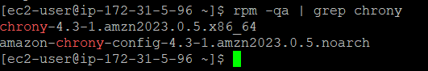
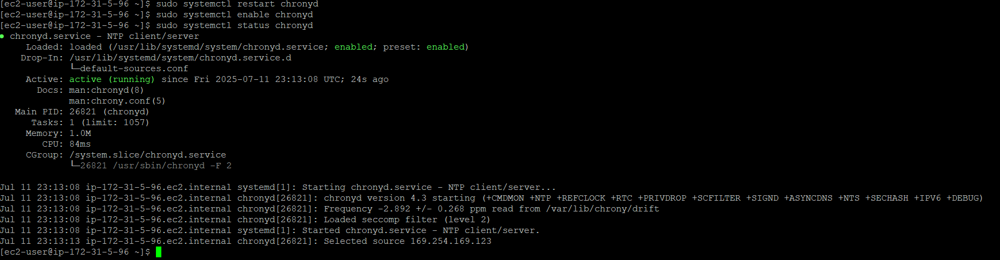

# Deploying Apache and Chrony on EC2

This project demonstrates how to launch and configure a web server on AWS using **Apache** (`httpd`) and enable **Chrony** (`chronyd`) for time synchronization on Amazon Linux 2023.

You’ll walk through:
- Provisioning an EC2 instance
- Installing and verifying Apache web server
- Installing and enabling Chrony time service
- Browser validation that the Apache server is running

---

## 🧰 Tools Used

- AWS EC2
- Amazon Linux 2023
- `yum`, `rpm`, `systemctl`
- Apache (`httpd`)
- Chrony (`chronyd`)

---

## 🖼️ Project Steps (with Screenshots)

1. **EC2 Configuration - Part 1**  
   

2. **EC2 Configuration - Part 2**  
   

3. **Running EC2 Instance**  
   

4. **System Update (`yum update`)**  
   

5. **Install Apache (`httpd`)**  
   

6. **Confirm Apache Installation**  
   

7. **Enable Apache Service**  
   

8. **Install `chrony` Package**  
   

9. **Confirm Chrony Installation**  
   

10. **Enable Chrony Service**  
   

11. **Verify Apache via Browser**  
   

---

## 📌 Notes

- Ensure inbound rules allow HTTP/SSH traffic in your security group.
- Use a valid key pair to SSH into your EC2 instance.

---

## ✅ Outcome

After completing the steps, Apache will serve a default test page confirming the server is active. Chrony will also be installed and synchronized for accurate system timekeeping.
