# 🚀 EC2‑to‑EC2 Secure File Transfer with **SSH + SCP** (inline walkthrough)

Automate two Amazon Linux 2023 instances via **bash user‑data**, establish key‑based SSH trust, copy a file with `scp`, then serve that file from Apache on the target box.

---

## 🗺️ Architecture

```text
EC2‑A  ──(SSH/SCP 22)──►  EC2‑B  →  /var/www/html/index.html  →  Browser
```
- **EC2‑A** = source (creates key, hosts text file)
- **EC2‑B** = destination (receives file, runs Apache)

---

## 🛠️ Prerequisites
- AWS account & default VPC
- Two security groups allowing inbound **SSH (22)** & **HTTP (80)** between hosts + from your IP
- Key‑pair to login the first time (or Session Manager)

---

## 🏗️  Step‑by‑step (with screenshots)

### 1 ▪️ Launch EC2‑A with bash user‑data
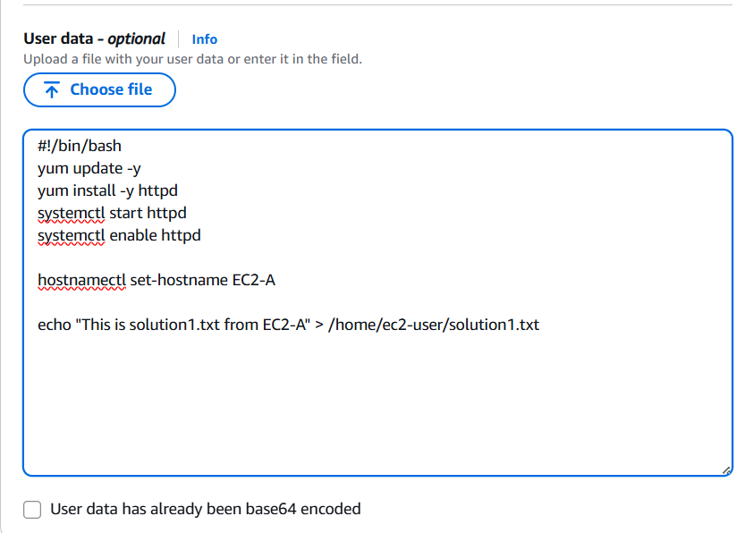

### 2 ▪️ Launch EC2‑B with bash user‑data
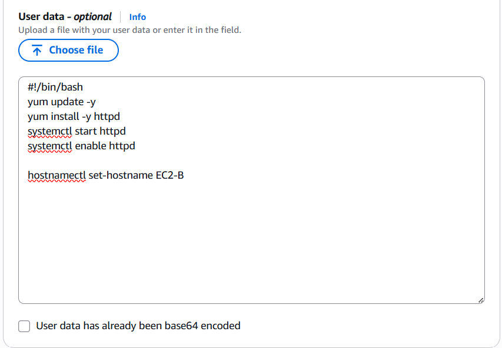

### 3 ▪️ Verify both instances are **running**
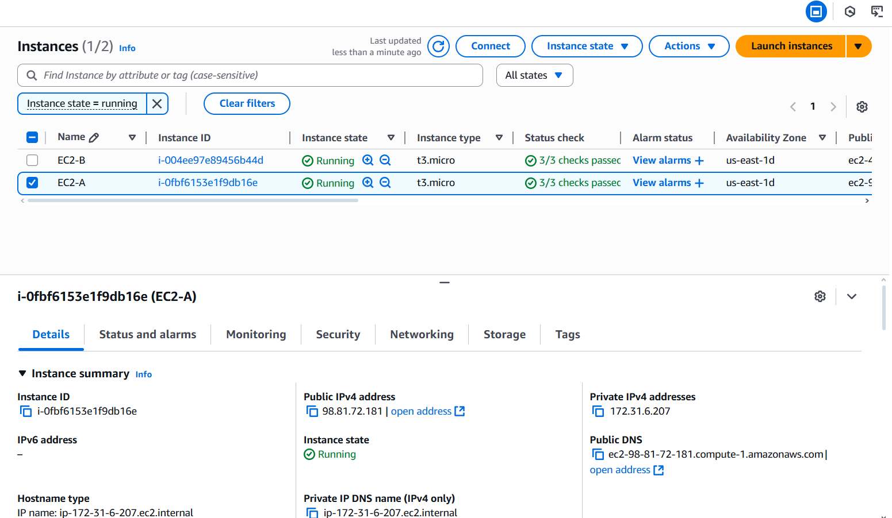

### 4 ▪️ Generate SSH key‑pair on **EC2‑A**
```bash
ssh-keygen
```
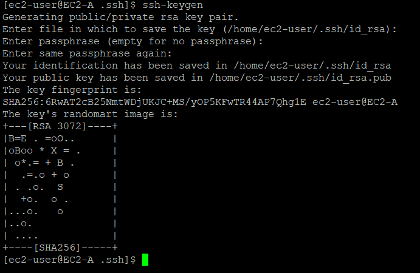

### 5 ▪️ Display the public key you just created
```bash
cat ~/.ssh/id_rsa.pub
```
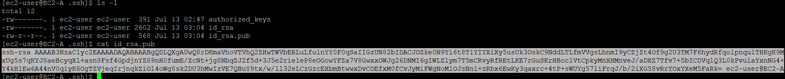

### 6 ▪️ Paste EC2‑A public key into **EC2‑B** `~/.ssh/authorized_keys`
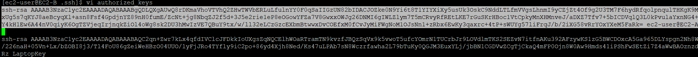

### 7 ▪️ Enable password auth in **EC2‑B** `sshd_config` (for demo)
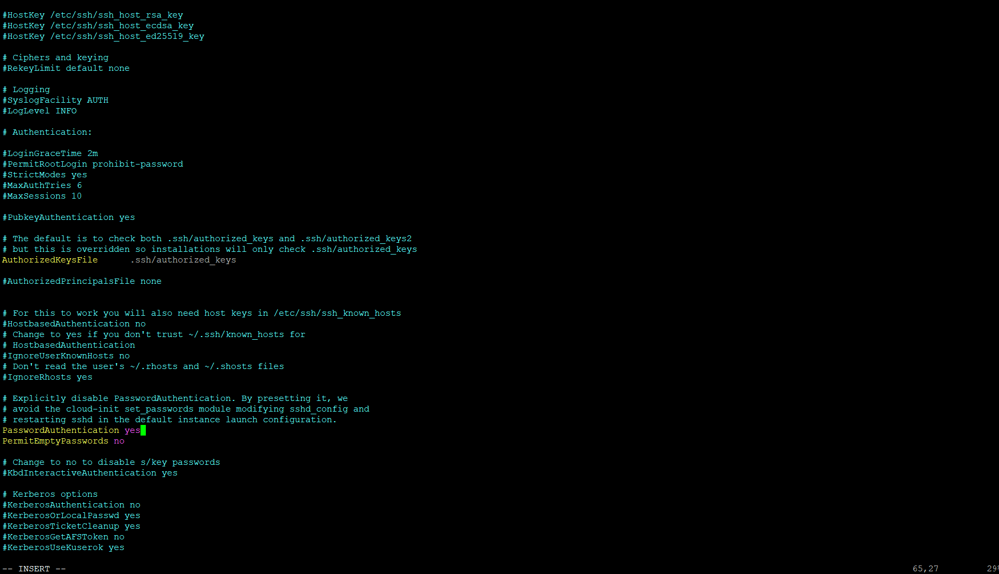

### 8 ▪️ Restart SSH on **EC2‑B**
```bash
sudo systemctl restart sshd
```


### 9 ▪️ Test SSH from **EC2‑A → EC2‑B** and create sample files
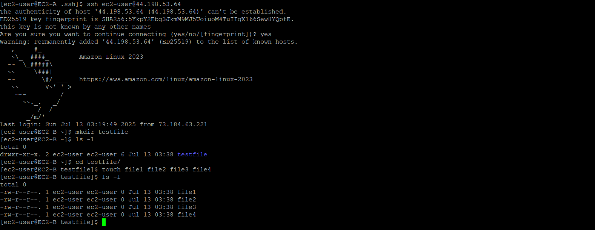

### 10 ▪️ Confirm files exist on **EC2‑B**
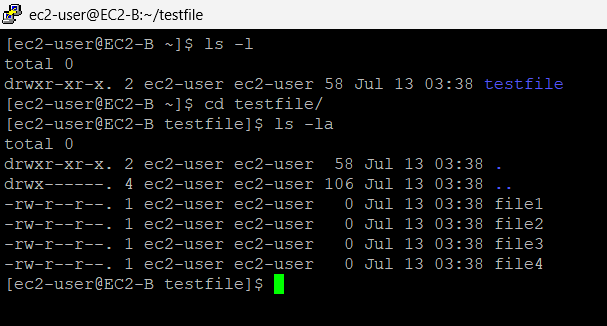

### 11 ▪️ Secure‑copy `solution1.txt` from EC2‑A to EC2‑B
```bash
scp /home/ec2-user/solution1.txt ec2-user@44.198.53.64:/home/ec2-user/
```
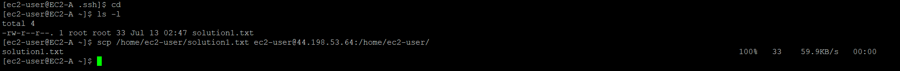

### 12 ▪️ Validate file arrived on **EC2‑B**


### 13 ▪️ Move file to Apache doc‑root as `index.html`
```bash
sudo mv solution1.txt /var/www/html/index.html
```
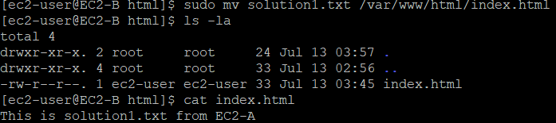

### 14 ▪️ Browse EC2‑B public IP — page shows transferred text!
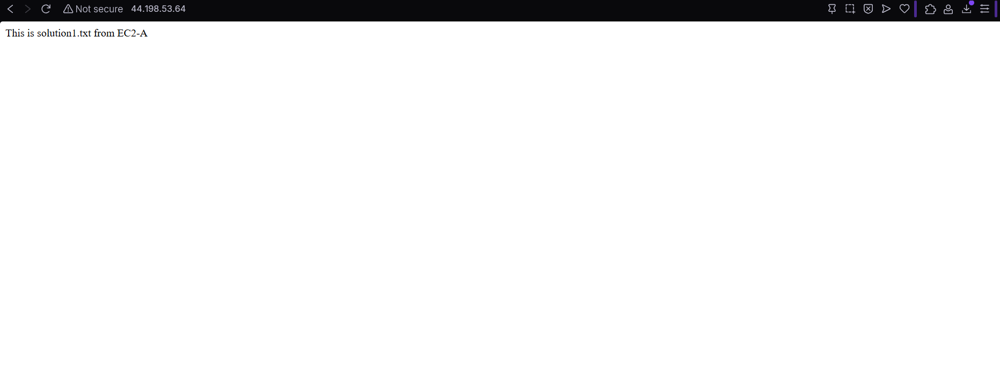

---

## ✅ Outcome
- **Automated provisioning** with bash‑based user‑data
- **Key‑based SSH** trust established between EC2s
- **SCP** used to transfer file securely
- **Apache** serves transferred content publicly
- Demonstrates practical AWS networking, Linux scripting, and DevOps workflow
