# 🚀 EC2-to-EC2 File Transfer Project (User-Data Bash, SSH/SCP, Apache)

## ✅ Outcome
By the end of this lab:

* **EC2-A** automatically built a file (`solution1.txt`) and securely copied it to **EC2-B** with **SCP**.  
* **EC2-B** moved that file to `/var/www/html/index.html`; visiting its public IP now shows the file’s contents in a browser.  
* You demonstrated end-to-end skills in AWS provisioning, bash automation, key-based SSH, SCP, and Apache hosting.

---

## 💡 Project Goals

| Goal | Proof |
| ---- | ----- |
| Launch 2 Amazon Linux 2023 instances with user-data bash scripts | Screens #1-2 |
| Automate Apache install, hostname change, sample file creation | Screens #1-2 |
| Configure key-based SSH from EC2-A → EC2-B | Screens #4-8 |
| Validate SSH connectivity | Screens #9-10 |
| Transfer file with SCP | Screens #11-12 |
| Serve the file on EC2-B via Apache | Screens #13-14 |

---

## 🛠️ Tools Used
* **AWS EC2** (t3.micro, user-data)
* **Amazon Linux 2023**  
* `yum`, `systemctl`, `hostnamectl`, `ssh` / `scp`
* **SSH key-based auth** (`~/.ssh/authorized_keys`)
* **Apache httpd**

---

## 📜 Commands Reference (quick-copy)

```bash
# Key generation on EC2-A
ssh-keygen -t rsa -b 4096
cat ~/.ssh/id_rsa.pub        # copy this

# On EC2-B
mkdir -p ~/.ssh
echo "<EC2-A-PUB-KEY>" >> ~/.ssh/authorized_keys
chmod 600 ~/.ssh/authorized_keys
sudo vi /etc/ssh/sshd_config # set PasswordAuthentication yes
sudo systemctl restart sshd

# Test SSH from EC2-A
ssh ec2-user@<EC2-B-IP>

# SCP transfer
scp /home/ec2-user/solution1.txt ec2-user@<EC2-B-IP>:/home/ec2-user/

# Host on Apache (EC2-B)
sudo mv /home/ec2-user/solution1.txt /var/www/html/index.html
```

---

## 🔹 Project Steps (with Screenshots)

| # | Description | Preview |
|---|-------------|---------|
|1 | **EC2-A User-Data Script** | 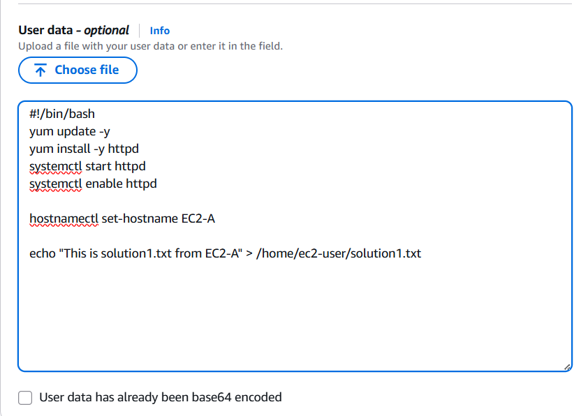 |
|2 | **EC2-B User-Data Script** | 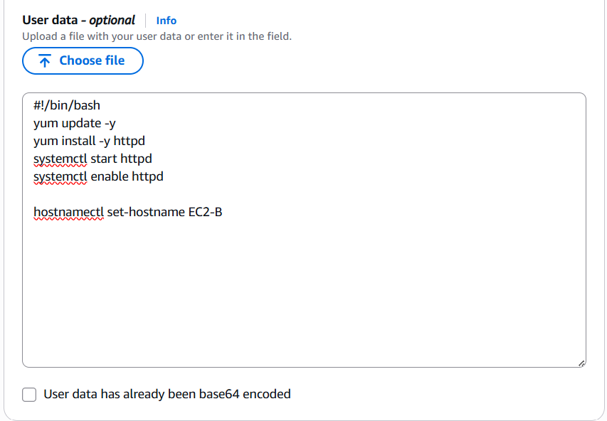 |
|3 | **Running Instances** | 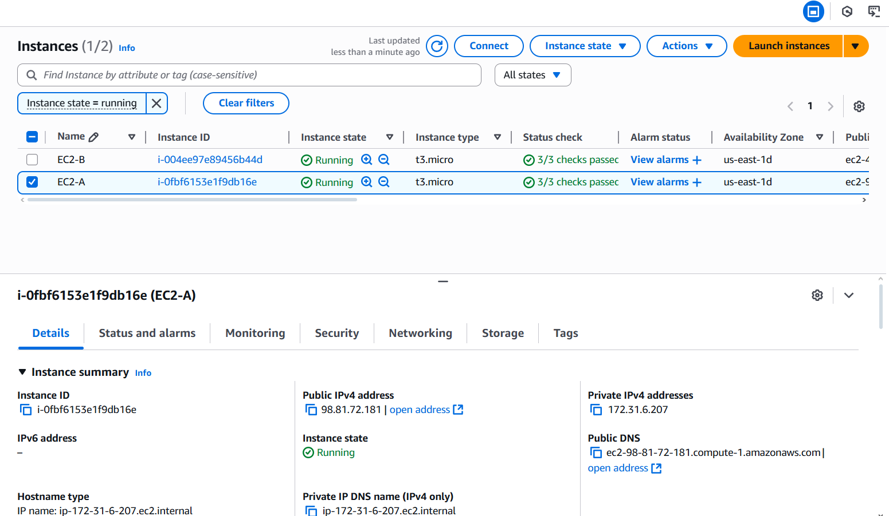 |
|4 | **Generate SSH Key (EC2-A)** | 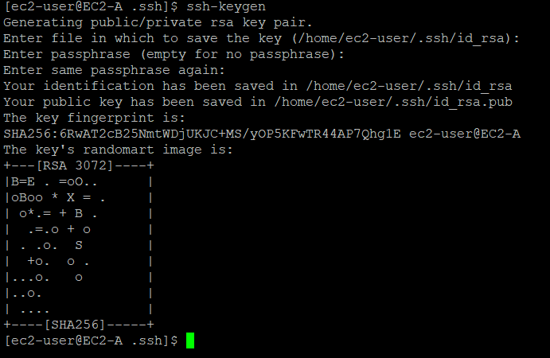 |
|5 | **Retrieve Public Key (EC2-A)** | 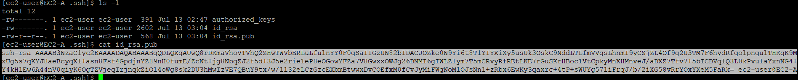 |
|6 | **Paste Key into `authorized_keys` (EC2-B)** | 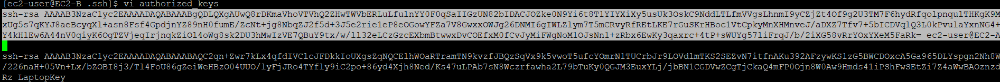 |
|7 | **Edit `sshd_config` (PasswordAuth = yes)** | 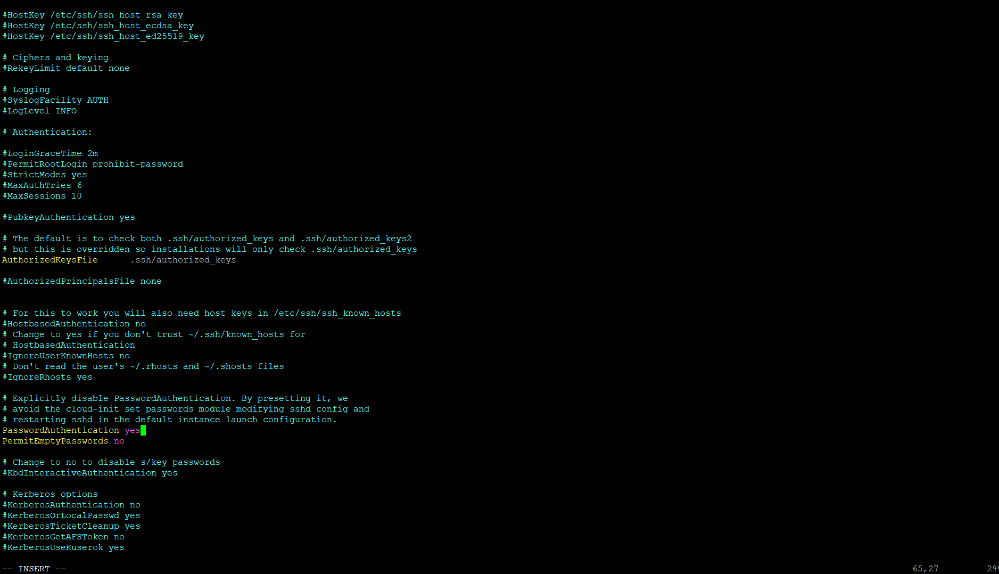 |
|8 | **Restart `sshd`** | 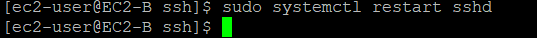 |
|9 | **Successful SSH from EC2-A → EC2-B** | 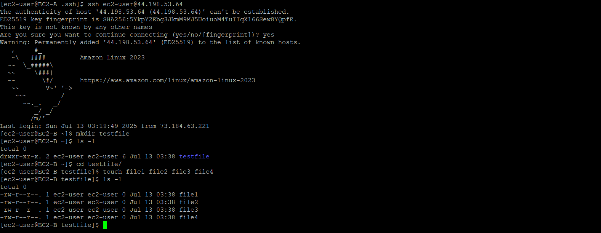 |
|10| **Files Created via SSH (EC2-B)** | 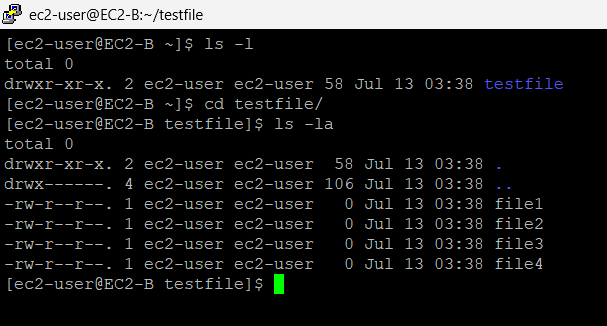 |
|11| **SCP Transfer** | 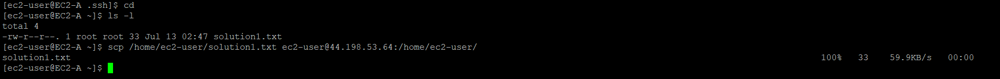 |
|12| **File Arrived on EC2-B** | 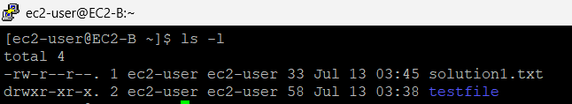 |
|13| **Move File to Apache `index.html`** | 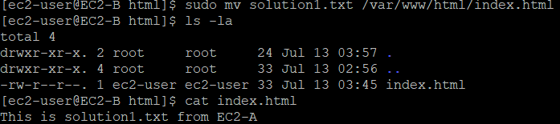 |
|14| **Browser Confirmation** | 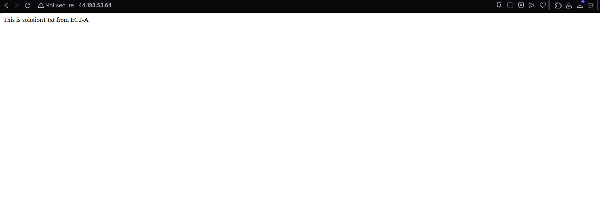 |

---

## 📌 Notes
* Open **SSH (22)** *and* **HTTP (80)** in EC2-B’s security group.
* Use the instance **public IP** for SCP/SSH, but private hostnames for east-west traffic inside a VPC in production.

---

## ▶️ How to View All Screenshots Quickly
🔹[See screenshots](./images/) ← this link opens the folder in GitHub.

---

## 🏆 What You Learned
* Non-interactive EC2 provisioning with **user-data** bash.  
* Securing inter-instance traffic with **key-based SSH**.  
* Using **SCP** for one-shot file transfer and validating arrival.  
* Exposing the result on a live **Apache** site—all fully reproducible.
