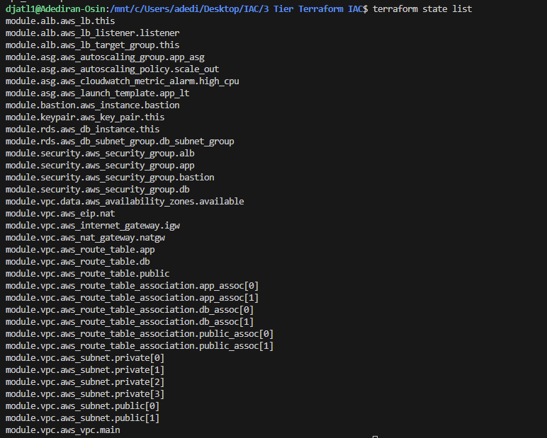

# **Terraform AWS 3-Tier Architecture**


---

## **📌 Project Summary**

This project provisions a **3-Tier architecture on AWS** using **Terraform with modular structure**.

Architecture includes:

- **Networking**: VPC, subnets, IGW, NAT Gateway, Route tables.
- **Security**: SGs for Bastion, ALB, App, DB.
- **Compute**: Bastion Host + Auto Scaling Group (App Layer).
- **Load Balancer**: Application Load Balancer.
- **Database**: RDS MySQL in private subnets.
- **Monitoring**: CloudWatch Alarm for Auto Scaling.
- **Remote State**: S3 bucket + DynamoDB for locking.
- **Key Pair**: For SSH access to Bastion and App servers.

---

## **✅ Directory Structure**

```
terraform-3tier/
├── boostrap/
│   │   ├── main.tf
│   │   ├── provider.tf
├── provider.tf
├── main.tf
├── variables.tf
├── outputs.tf
├── terraform.tfvars
├── /modules
│   ├── vpc/
│   │   ├── main.tf
│   │   ├── variables.tf
│   │   └── outputs.tf
│   ├── security/
│   │   ├── main.tf
│   │   ├── variables.tf
│   │   └── outputs.tf
│   ├── ec2/   (Bastion Host)
│   │   ├── main.tf
│   │   ├── variables.tf
│   │   └── outputs.tf
│   ├── alb/
│   │   ├── main.tf
│   │   ├── variables.tf
│   │   └── outputs.tf
│   ├── asg/
│   │   ├── main.tf
│   │   ├── variables.tf
│   │   └── outputs.tf
│   └── rds/
│   │  ├── main.tf
│   │    ├── variables.tf
│   │    └── outputs.tf
│   └── keypair/
│       ├── main.tf
│       ├── variables.tf
│       └── outputs.tf
└── /images  (Screenshots for documentation)

```

---

## **✅ Prerequisites**

- [Terraform CLI](https://developer.hashicorp.com/terraform/downloads)
- [AWS CLI](https://docs.aws.amazon.com/cli/latest/userguide/install-cliv2.html)
- AWS credentials configured:

```bash
aws configure

```

Generate SSH Key:

```bash
ssh-keygen -t rsa -b 4096 -f ~/.ssh/LaptopKey
```

- A key pair named `LaptopKey` (public key available locally).
- Creation of S3 bucket and DynamoDB Table (covered step 1)

📸 **Screenshot:** AWS CLI after `aws configure`.

---

## **✅ Step 1: Configuring Bootstrap resources**

First we need to provision the S3 bucket that will retain our terraform.tfstate, as well as our DynamoDB table that will be used for state locking. Create a directory called bootstrap and create two files within it,**`main.tf`** and **`provider.tf`** 

**`main.tf`**

```hcl
## Bootstrap main.tf

# S3 bucket for Terraform state
resource "aws_s3_bucket" "tf_state" {
  bucket = "terraform-remote-state-641647330206"

  tags = {
    Name = "Terraform Remote State"
  }
}

# Enable versioning
resource "aws_s3_bucket_versioning" "tf_state_versioning" {
  bucket = aws_s3_bucket.tf_state.id

  versioning_configuration {
    status = "Enabled"
  }
}

# Enable encryption
resource "aws_s3_bucket_server_side_encryption_configuration" "tf_state_encryption" {
  bucket = aws_s3_bucket.tf_state.id

  rule {
    apply_server_side_encryption_by_default {
      sse_algorithm = "AES256"
    }
  }
}

# Block all public access
resource "aws_s3_bucket_public_access_block" "tf_state_block" {
  bucket = aws_s3_bucket.tf_state.id

  block_public_acls       = true
  block_public_policy     = true
  ignore_public_acls      = true
  restrict_public_buckets = true
}

# DynamoDB table for state locking
resource "aws_dynamodb_table" "tf_locks" {
  name         = "terraform-locks"
  billing_mode = "PAY_PER_REQUEST"
  hash_key     = "LockID"

  attribute {
    name = "LockID"
    type = "S"
  }

  tags = {
    Name = "Terraform Locks Table"
  }
}

```

**`provider.tf`** 

```hcl
terraform {
  required_providers {
    aws = {
      source  = "hashicorp/aws"
      version = "~> 6.0"
    }
  }
}

# Configure the AWS Provider
provider "aws" {
  region = "us-east-1"
}
```

Now we need to provision these resources for the rest of this project to work successfully.

```bash
terraform init
terraform validate
terraform apply
```

## **✅ Step 2: Configure root backend.tf**

Now we need to configure our main root `backend.tf`  ensuring its referencing the resources we created in our bootstrap. This will allow our tfstate file to be saved in the cloud.

Add `backend.tf`:

```hcl
terraform {
  backend "s3" {
    bucket         = "terraform-remote-state-641647330206"
    key            = "3tier/terraform.tfstate"
    region         = "us-east-1"
    dynamodb_table = "terraform-locks"
    encrypt        = true
  }
}
```

Initialize:

```bash
terraform init -reconfigure

```


---

## **✅ Step 3: Complete Root Configuration**

After getting the backend setup we can proceed to completing the rest of the necessary root files for this project.

### **provider.tf**

```hcl
terraform {
  required_providers {
    aws = {
      source  = "hashicorp/aws"
      version = "~> 6.0"
    }
  }
}

# Configure the AWS Provider
provider "aws" {
  region = "us-east-1"
}
```

### backend.tf

```hcl
terraform {
  backend "s3" {
    bucket         = "terraform-remote-state-641647330206"
    key            = "3tier/terraform.tfstate"
    region         = "us-east-1"
    dynamodb_table = "terraform-locks"
    encrypt        = true
  }
}

```

### **variables.tf**

```hcl
variable "region" { default = "us-east-1" }
variable "vpc_cidr" { default = "10.0.0.0/16" }
variable "public_subnets" { type = list(string) }
variable "private_subnets" { type = list(string) }
variable "key_name" {}
variable "instance_type" { default = "t2.micro" }
variable "db_username" {}
variable "db_password" {}
variable "ami_id" {
  description = "AMI ID for EC2 instances"
  type        = string
  default     = ""
}
variable "my_ip" {
  description = "73.184.63.221/32"
  type        = string
}

```

### **terraform.tfvars**

```hcl
region          = "us-east-1"
public_subnets  = ["10.0.1.0/24", "10.0.2.0/24"]
private_subnets = ["10.0.3.0/24", "10.0.4.0/24", "10.0.5.0/24", "10.0.6.0/24"]
key_name        = "LaptopKey"
db_username     = "admin"
db_password     = "SuperSecurePass123"
ami_id = "ami-020cba7c55df1f615" 
my_ip = "73.184.63.221/32" 

```

### **outputs.tf**

These outputs reference key infrastructure components defined in the modules. They provide quick access to essential information, such as DNS names, public IPs, and database endpoints after applying your configuration.

While the following outputs are mostly sufficient for this project, you can add additional outputs as needed to avoid relying on the AWS console for information about your resources.

```hcl
output "alb_dns" { value = module.alb.alb_dns_name }
output "bastion_ip" { value = module.bastion.public_ip }
output "asg_name" { value = module.asg.asg_name }
output "rds_endpoint" { value = module.rds.db_endpoint }

```

📸 **Screenshot:** VS Code with root files visible.

---

## **✅ Step 4: Modules**

Now create each module folder and files within. There should be 7 modules created in total (VPC, Security, EC2 or Bastion, ALB, ASG, RDS, Keypair) each containing three files: `main.tf`, `outputs.tf`, and `variables.tf`. 

```
├── /modules
│   ├── vpc/
│   │   ├── main.tf
│   │   ├── variables.tf
│   │   └── outputs.tf
│   ├── security/
│   │   ├── main.tf
│   │   ├── variables.tf
│   │   └── outputs.tf
│   ├── ec2/   (Bastion Host)
│   │   ├── main.tf
│   │   ├── variables.tf
│   │   └── outputs.tf
│   ├── alb/
│   │   ├── main.tf
│   │   ├── variables.tf
│   │   └── outputs.tf
│   ├── asg/
│   │   ├── main.tf
│   │   ├── variables.tf
│   │   └── outputs.tf
│   └── rds/
│   │  ├── main.tf
│   │    ├── variables.tf
│   │    └── outputs.tf
│   └── keypair/
│       ├── main.tf
│       ├── variables.tf
│       └── outputs.tf
```

### VPC

`modules/vpc/main.tf`
This is the core module that builds the entire network foundation for our 3-tier application. It creates the main Virtual Private Cloud (VPC), sets up public and private subnets across different availability zones, configures an Internet Gateway for public access, and a NAT Gateway for private subnet outbound access. It also defines the necessary route tables to direct traffic correctly between these network components.

```hcl
resource "aws_vpc" "main" {
  cidr_block = var.vpc_cidr
  tags = { Name = "ThreeTier-VPC" }
}

resource "aws_internet_gateway" "igw" {
  vpc_id = aws_vpc.main.id
  tags = { Name = "ThreeTier-IGW" }
}

# Public Subnets
resource "aws_subnet" "public" {
  count             = length(var.public_subnets)
  vpc_id            = aws_vpc.main.id
  cidr_block        = var.public_subnets[count.index]
  map_public_ip_on_launch = true
  availability_zone = element(data.aws_availability_zones.available.names, count.index)
  tags = { Name = count.index == 0 ? "Public-1a" : "Public-1b" }
}

# Private Subnets (App + DB)
resource "aws_subnet" "private" {
  count             = length(var.private_subnets)
  vpc_id            = aws_vpc.main.id
  cidr_block        = var.private_subnets[count.index]
  availability_zone = element(data.aws_availability_zones.available.names, count.index)
  tags = {
    Name = count.index < 2 ? (count.index == 0 ? "App-1a" : "App-1b") : (count.index == 2 ? "DB-1a" : "DB-1b")
  }
}

# NAT Gateway
resource "aws_eip" "nat" {
  tags = { Name = "ThreeTier-NAT-EIP" }
}

resource "aws_nat_gateway" "natgw" {
  allocation_id = aws_eip.nat.id
  subnet_id     = aws_subnet.public[0].id
  tags = { Name = "ThreeTier-NATGW" }
}

# Route Tables
resource "aws_route_table" "public" {
  vpc_id = aws_vpc.main.id
  route {
    cidr_block = "0.0.0.0/0"
    gateway_id = aws_internet_gateway.igw.id
  }
  tags = { Name = "Public-RT" }
}

resource "aws_route_table_association" "public_assoc" {
  count          = length(aws_subnet.public)
  subnet_id      = aws_subnet.public[count.index].id
  route_table_id = aws_route_table.public.id
}

resource "aws_route_table" "app" {
  vpc_id = aws_vpc.main.id
  route {
    cidr_block     = "0.0.0.0/0"
    nat_gateway_id = aws_nat_gateway.natgw.id
  }
  tags = { Name = "App-RT" }
}

resource "aws_route_table_association" "app_assoc" {
  count          = 2
  subnet_id      = aws_subnet.private[count.index].id
  route_table_id = aws_route_table.app.id
}

resource "aws_route_table" "db" {
  vpc_id = aws_vpc.main.id
  tags   = { Name = "DB-RT" }
}

resource "aws_route_table_association" "db_assoc" {
  count          = 2
  subnet_id      = aws_subnet.private[count.index + 2].id
  route_table_id = aws_route_table.db.id
}

data "aws_availability_zones" "available" {}

```

`modules/vpc/outputs.tf`

*Take note that we configured outputs here for the VPC. If we would like we could add these to our main [outputs.tf] file to get these values when we finally do our final terraform apply. 

Additionally outputs expose important IDs created by the VPC module (like VPC ID, public and private subnets) so that other modules (Security Groups, ALB, ASG, RDS) can use them. Without these outputs, we cannot dynamically link our modules together.

```hcl
output "vpc_id" { value = aws_vpc.main.id }
output "public_subnet_ids" { value = aws_subnet.public[*].id }
output "private_subnet_ids" { value = aws_subnet.private[*].id }

```

`modules/vpc/variables.tf`

These variables act as place holders inside the VPC module. When we call the VPC module from `main.tf` in the root, Terraform passes actual values (from `terraform.tfvars`) into these variables.

```hcl
variable "vpc_cidr" {}
variable "public_subnets" { type = list(string) }
variable "private_subnets" { type = list(string) }

```

### Security

`modules/security/main.tf` 

This section defines the security groups essential for our 3-tier architecture, ensuring controlled network access between layers. The **Bastion Security Group** is configured to allow SSH access only from a specified IP address (`var.my_ip`), acting as a secure jump host into the private network. The **ALB Security Group** permits inbound HTTP traffic from anywhere (`0.0.0.0/0`), as it's the public-facing entry point for the application. Crucially, the **Application Security Group** is designed to accept HTTP requests solely from the ALB's security group, preventing direct public access to the application servers, and also allows SSH from the Bastion for management. Finally, the **Database Security Group** is the most restricted, allowing inbound MySQL/RDS traffic only from the Application Security Group, ensuring that only the application tier can communicate with the database. All security groups allow unrestricted outbound traffic for general connectivity.

Imagine our computer setup is like a house with different rooms.

- **Bastion's Door:** This is a special door that only *we* (from our specific computer) can open to get into the house. It's like a secret entrance just for us.
- **ALB's Door:** This is the main front door of our house. Anyone can knock on this door (send web traffic), and we let them in.
- **App's Door:** This room is inside the house. We can only get into this room if we came through the ALB's front door. Also, if we came in through the Bastion's secret door, we can also get into this room to fix things.
- **Database's Door:** This is the innermost room, like a treasure room. Only people who are already in the "App" room can get into this "Database" room. No one else can!

And from any room, we can always go *out* to anywhere we want. This keeps our house safe by deciding who can go into which room.

```hcl
resource "aws_security_group" "bastion" {
  name   = "SG-Bastion"
  vpc_id = var.vpc_id
  
  ingress {
  description = "SSH from my IP"
  from_port   = 22
  to_port     = 22
  protocol    = "tcp"
  cidr_blocks = [var.my_ip]
}

  egress {
    from_port   = 0
    to_port     = 0
    protocol    = "-1"
    cidr_blocks = ["0.0.0.0/0"]
  }
  tags = { Name = "SG-Bastion" }
}

resource "aws_security_group" "alb" {
  name   = "SG-ALB"
  vpc_id = var.vpc_id
  ingress {
    from_port   = 80
    to_port     = 80
    protocol    = "tcp"
    cidr_blocks = ["0.0.0.0/0"]
  }
  egress {
    from_port   = 0
    to_port     = 0
    protocol    = "-1"
    cidr_blocks = ["0.0.0.0/0"]
  }
  tags = { Name = "SG-ALB" }
}

resource "aws_security_group" "app" {
  name   = "SG-App"
  vpc_id = var.vpc_id
  ingress {
    from_port       = 80
    to_port         = 80
    protocol        = "tcp"
    security_groups = [aws_security_group.alb.id]
  }
  ingress {
  from_port       = 22
  to_port         = 22
  protocol        = "tcp"
  security_groups = [aws_security_group.bastion.id] # Allow SSH from Bastion SG
}

  egress {
    from_port   = 0
    to_port     = 0
    protocol    = "-1"
    cidr_blocks = ["0.0.0.0/0"]
  }
  tags = { Name = "SG-App" }
}

resource "aws_security_group" "db" {
  name   = "SG-DB"
  vpc_id = var.vpc_id
  ingress {
    from_port       = 3306
    to_port         = 3306
    protocol        = "tcp"
    security_groups = [aws_security_group.app.id]
  }
  egress {
    from_port   = 0
    to_port     = 0
    protocol    = "-1"
    cidr_blocks = ["0.0.0.0/0"]
  }
  tags = { Name = "SG-DB" }
}

```

`modules/security/outputs.tf`

```hcl
output "bastion_sg_id" { value = aws_security_group.bastion.id }
output "alb_sg_id" { value = aws_security_group.alb.id }
output "app_sg_id" { value = aws_security_group.app.id }
output "db_sg_id" { value = aws_security_group.db.id }
```

`modules/security/variables.tf`

```hcl
variable "vpc_id" {}
variable "my_ip" {
  description = "73.184.63.221/32"
  type        = string
}

```

### Key Pair

`modules/keypair/main.tf` 

This is the main file that tells Terraform to create an AWS key pair using the name and the actual public key file we provide.

```hcl
resource "aws_key_pair" "this" {
  key_name   = var.key_name
  public_key = file("${path.module}/../../keys/LaptopKey.pub")
}
```

`modules/keypair/outputs.tf`

This file outputs the name of the key pair after its created. Other modules (like EC2 or ASG) can reference it, so they know which key to use for SSH

```hcl
output "key_name" {
  value = aws_key_pair.this.key_name
}
```

`modules/keypair/variables.tf`

```hcl
variable "key_name" {
  description = "Name of the key pair"
  type        = string
}

variable "public_key_path" {
  description = "Path to your local public key"
  type        = string
}
```

Concept to understand:

Terraform is using the local public key we made to create a key pair in AWS, and then it uses the name of that AWS-managed key pair to tell your EC2 instances which key to use for authentication. 

### EC2

`modules/ec2/main.tf`

Here you can see instead of hardcoding this entire script is made up of variables. This is important for replicability and reuse. Everything defined is being pulled from variables we have pre defined earlier in our infra.

```hcl
resource "aws_instance" "bastion" {
  ami = var.image_id
  instance_type               = var.instance_type
  subnet_id                   = var.subnet_id
  key_name                    = var.key_name
  vpc_security_group_ids      = var.security_group_ids
  associate_public_ip_address = true
  tags = { Name = "BastionHost" }
}
```

`modules/ec2/outputs.tf`

This output exposes the public IP address of our Bastion host, allowing us to easily reference it for SSH access without having to look it up in the AWS console.

```hcl
output "public_ip" { value = aws_instance.bastion.public_ip }
```

`modules/ec2/variables.tf`

```hcl
variable "subnet_id" {}
variable "key_name" {
  type = string
}
variable "instance_type" {}
variable "security_group_ids" { type = list(string) }
variable "image_id" {
  description = "ami-020cba7c55df1f615"
}
```

### ALB

`modules/alb/main.tf`

This module creates our Application Load Balancer, which acts as the front door for our application. It sets up the load balancer itself, a target group to hold to our application servers, and a listener that forwards all web traffic (on port 80) from the load balancer to the target group.

```hcl
resource "aws_lb" "this" {
  name               = "app-alb"
  internal           = false
  load_balancer_type = "application"
  security_groups    = [var.alb_sg_id]
  subnets            = var.public_subnets
}

resource "aws_lb_target_group" "this" {
  name     = "app-tg"
  port     = 80
  protocol = "HTTP"
  vpc_id   = var.vpc_id

  health_check {
    path                = "/"
    healthy_threshold   = 2
    unhealthy_threshold = 2
    timeout             = 5
    interval            = 30
    matcher             = "200"
  }
}

resource "aws_lb_listener" "listener" {
  load_balancer_arn = aws_lb.this.arn
  port              = 80
  protocol          = "HTTP"

  default_action {
    type             = "forward"
    target_group_arn = aws_lb_target_group.this.arn
  }
}
```

`modules/alb/outputs.tf`

Output 1: `alb_dns_name`This outputs the public web address (DNS name) of the load balancer. This is the URL we will use to access our application.

Output 2: `tg_arn` This outptus the unique identifier (ARN) of the target group. We need this ARN to tell our Auto Scaling Group module where to register its servers. 

```hcl
output "alb_dns_name" {
  description = "DNS name of the ALB"
  value       = aws_lb.this.dns_name
}

output "tg_arn" {
  description = "Target group ARN"
  value       = aws_lb_target_group.this.arn
}

```

`modules/alb/variables.tf`

```hcl
variable "public_subnets" { type = list(string) }
variable "alb_sg_id" {}
variable "vpc_id" {}
```

### ASG

`modules/asg/main.tf`

This module sets up our Auto Scaling Group (ASG) for the application tier, ensuring our app can automatically scale based on demand. It defines a **Launch Template** that specifies how new EC2 instances should be configured (including the AMI, instance type, key pair, and security group), and includes a `user_data` script to install Apache and deploy a simple welcome page. The **Auto Scaling Group** itself then uses this template to maintain a desired number of instances across our private subnets, automatically registering them with the Application Load Balancer's target group. Finally, a **CloudWatch Alarm** monitors CPU utilization and triggers an **Auto Scaling Policy** to add more instances if the CPU threshold is exceeded, ensuring our application can handle increased traffic.

```hcl
resource "aws_launch_template" "app_lt" {
  name_prefix   = "App-LT"
  image_id      = var.ami_id
  instance_type = var.instance_type
  key_name      = var.key_name
  vpc_security_group_ids = [var.app_sg_id]

  user_data = base64encode(<<-EOF
    #!/bin/bash
    apt-get update -y
    apt-get install -y apache2
    systemctl enable apache2
    systemctl start apache2
    echo "<h1>Welcome to the App Tier - Deployed via Terraform ASG (Ubuntu)</h1>" > /var/www/html/index.html
  EOF
  )

  lifecycle {
    create_before_destroy = true
  }
}

resource "aws_autoscaling_group" "app_asg" {
  desired_capacity     = 2
  max_size             = 3
  min_size             = 1
  vpc_zone_identifier  = var.app_subnet_ids

  launch_template {
    id      = aws_launch_template.app_lt.id
    version = "$Latest"
  }

  target_group_arns = [var.tg_arn]

  tag {
    key                 = "Name"
    value               = "App-ASG"
    propagate_at_launch = true
  }

  health_check_type         = "ELB"
  health_check_grace_period = 300
}

resource "aws_autoscaling_policy" "scale_out" {
  name                   = "${var.asg_name}-scale-out"
  scaling_adjustment     = 1
  adjustment_type        = "ChangeInCapacity"
  cooldown               = 60
  autoscaling_group_name = aws_autoscaling_group.app_asg.name
}

resource "aws_cloudwatch_metric_alarm" "high_cpu" {
  alarm_name          = "${var.asg_name}-high-cpu"
  comparison_operator = "GreaterThanOrEqualToThreshold"
  evaluation_periods  = 2
  metric_name         = "CPUUtilization"
  namespace           = "AWS/EC2"
  period              = 60
  statistic           = "Average"
  threshold           = 20 # Lower for testing, change back to 70 later
  alarm_description   = "Triggers when CPU is >= 20%"
  dimensions = {
    AutoScalingGroupName = aws_autoscaling_group.app_asg.name
  }
  alarm_actions = [aws_autoscaling_policy.scale_out.arn]
}

```

`modules/asg/outputs.tf`

This output exposes the name of the Auto Scaling Group. This can be useful for referencing or monitoring the ASG from outside this module.

```hcl
output "asg_name" {
  value = aws_autoscaling_group.app_asg.name
}
```

`modules/asg/variables.tf`
These variables define the essential parameters for our Auto Scaling Group, including the subnets where instances will launch, the SSH key name, instance type, AMI ID, the application security group ID, and the ARN of the target group to which instances will register. We also define a default name for the ASG.

```hcl
variable "app_subnet_ids" { type = list(string) }

variable "key_name" {
  type = string
}

variable "instance_type" {}
variable "tg_arn" {}
variable "ami_id" {
  description = "ami-020cba7c55df1f615"
}
variable "app_sg_id" {
  description = "sg-012f10895bb0688da"
  type        = string
}

variable "asg_name" {
  description = "Name of the Auto Scaling Group"
  type        = string
  default     = "app-tier-asg"
}
```

### RDS

`modules/rds/main.tf`
This module provisions our Amazon RDS database instance, which will serve as the persistent data storage for our application. It first creates a **DB Subnet Group** to ensure the database is deployed securely within our private subnets. Then, it defines the **RDS instance** itself, specifying its engine (MySQL), size, and linking it to the security group that allows access only from our application tier.

```hcl
resource "aws_db_subnet_group" "db_subnet_group" {
  name       = "three-tier-db-subnet-group"
  subnet_ids = var.subnet_ids
}

resource "aws_db_instance" "this" {
  allocated_storage    = 20
  engine               = "mysql"
  engine_version       = "8.0"
  instance_class       = "db.t3.micro"
  username             = var.db_username
  password             = var.db_password
  db_subnet_group_name = aws_db_subnet_group.db_subnet_group.name
  vpc_security_group_ids = [var.sg_id]
  skip_final_snapshot  = true
  tags = { Name = "ThreeTier-DB" }
}

```

`modules/rds/outputs.tf` 
This output exposes the **endpoint** (the network address) of our newly created RDS database instance. This is the address our application tier will use to connect to the database.

```hcl
output "endpoint" {
  description = "RDS instance endpoint"
  value       = aws_db_instance.this.endpoint
}

```

 

`modules/rds/variables.tf`

These variables define the essential configuration for our RDS database, including the private subnet IDs where it will reside, the database username and password, and the security group ID that controls access to the database.

```hcl
variable "subnet_ids" { type = list(string) }
variable "db_username" {}
variable "db_password" {}
variable "sg_id" {}

```

---

## **✅ Step 4: Deploy**

```bash
terraform init
terraform validate
terraform plan
terraform apply

```


---

## **✅ Step 5: Validate Infrastructure**

1. **Outputs:** `terraform output`
    
    
    

1. **Test ALB:** `curl http://$(terraform output -raw alb_dns_name)`
    
    
    
    
    

1. **SSH to Bastion:** `ssh -i LaptopKey.pem ubuntu@<bastion_public_ip>`
    
    
    

1. **Copy private key to Bastion & SSH into App:** `scp -i LaptopKey.pem LaptopKey.pem ubuntu@<bastion_public_ip>:/home/ubuntu/`


1. **Stress Test:** `sudo stress --cpu 50 --timeout 500`

Activation of stress test in App server


Results of stress test:
 - New instance provisioned

 - ASG activity history

 - Cloud watch in alarm state


1. **Test RDS Connection:** `mysql -h <rds_endpoint> -u admin -p`

Successful Access: `mysql>`


### Additional Photos:





---

## **✅ Step 6: Destroy Infrastructure**

```bash
terraform destroy

```


